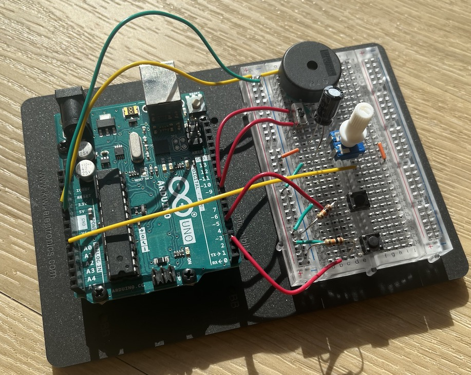

# Project Echo

1. [Over dit verslag](#over-dit-verslag)
1. [Ultrasoon geluid](#ultrasoon-geluid)
1. [Bluetooh Low Energy](#bluetooth-low-energy)
1. [Ultra Wide Band](#ultra-wide-band)
1. [Technische details](#technische-details)
1. [Samenvatting](#samenvatting)

## 0. Historie

2023-09-24: Document aangemaakt.

## 1. Over deze repository
Die code in deze repository i.c.m. met dit verslag is het resultaat van een kort onderzoekstraject naar een mobiele applicatie (_app_) die detecteert in welke ruimte de gebruiker zich bevindt. 

Dit onderzoek is uitgevoerd namems [pierreCode](https://www.pierrecode.nl) door Edwin Veger.

## 2. Ultrasoon geluid
Eén van de onderzoeksrichtingen is het Arduino platform, voor een kleine beacon die zijn ID uitzendt in ultrasoon geluid. Een kleine piëzo speaker 
Het voordeel van zo’n oplossing is dat de beacons zeer lichtgewicht zijn. Daarnaast is de gebruiker niet afhankelijk van de ondersteuning en/of het voortbestaan van een derde partij. Het nadeel is dat er een stuk meer onderzoek nodig is voor het komen tot een praktische uitvoering.

Het werd snel duidelijk dat het niet haalbaar was om binnen de beschikbare tijd een functionerend prototype o.b.v. ultrasoon geluid op te zetten. Hieronder volgt een rudimentair en beknopt verslag.

### Ontwerp Arduino

Voor het prototype is een Arduino Uno gebruikt i.c.m. een actieve piëzo speaker. De [Arduino code](./Arduino/prototype_beacon) zendt met tussenpozen een 4-bits signaal uit op 2kHz. Een potentiometer kan de frequentie aanpassen tussen 2kHz en 4kHz.

Het signaal wordt opgevangen in de app via de microfoon en de relevantie frequentie worden gemeten via [FFT](https://en.wikipedia.org/wiki/Fast_Fourier_transform). 
De sample rate van de ontvanger bepaalt de maximum detecteerbare frequentie (zie [Nyquist](https://en.wikipedia.org/wiki/Nyquist_frequency)). 
Afhankelijk van de bitrate van de zender en de sample rate van de ontvanger (44.1kHz) zal de ontvanger moeten synchronizeren.

Op onderstaande foto's is het prototype te zien. De twee knoppen kunnen worden gebruikt om het signaal in en uit te schakelen.

### Ontwerp app

De app bevat een FFT scherm waarop geluid van de microfoon wordt weergegeven in een amplitude- en frequentiegrafiek. Er wordt geluisterd naar een 2kHz frequentie waarbij de drempelwaarde (instelbaar met een schuif) bepaald of het signaal wordt geinterpreteerd als 0 of 1. Dit binaire signaal wordt getoond met een _rolling window_.

### Bevindingen

De mate van signaaloverdracht is sterk afhankelijk van:

 * Specificaties piëzo
 * Gebruikte frequentie
 * Golfvorm (blok of sinus)
 * Omgevingsgeluid

Het produceren van een sinus-golf vereist een sample rate aan de kant van de zender die correleert met de frequentie. Hiervoor kan bijvoorbeeld een losse [DAC](https://en.wikipedia.org/wiki/Digital-to-analog_converter) worden ingezet i.c.m. een passieve piëzo.

Het is duidelijk dat een dergelijke oplossing veel technieken en heuristieken zou vereisen die "gratis" komen met BLE/UWB.

### Zie ook
 * [Amplitude-shift keying](https://en.wikipedia.org/wiki/Amplitude-shift_keying)
 * [Phase Locked Loop](https://en.wikipedia.org/wiki/Phase-locked_loop)
 * [Zero Crossing Deteection](https://en.wikipedia.org/wiki/Zero_crossing)

## 3. Bluetooth Low Energy

Voor simpele tracking op basis van [Received Signal Strength Indictator](https://www.bluetoothle.wiki/rssi) (RSSI) is een beacon nodig die een constant, uniek ID uitzendt. Na onderzoek naar trackers van ZFINDER en Tile bleek dat het sneller zou zijn om zelf een Arduino beacon te programmeren, daar men dan volledige controle heeft.

### Software

Link naar [Arduino code](./Arduino/simple_ble_peripheral) voor een simpele BLE beacon. 

### Hardware

 * Arduino Nano ESP32 (of een andere Arduino microcontroller met Bluetooth)
 * (optioneel) LED met 220Ω weerstand van pin D2 naar GND voor indicatie connectie
 * (optioneel) breadboard + stroommodule voor het aansluiten van een batterij

### Aanbeveling

In de praktijk technieken als fingerprinting en [trilateration](https://en.wikipedia.org/wiki/Trilateration) toegepast om de onnauwkeurigheid van RSSI tegen te gaan.

## 4. Ultra Wide Band
Apple introduceerde in 2019 een UWB chip voor nauwkeurig afstandsbepaling tussen apparaten. Deze technologie heeft ook zijn weg gevonden [naar Android telefoons](https://developer.android.com/guide/topics/connectivity/uwb). In documentatie noemt Apple het ook wel [Nearby Interaction with UWB](https://developer.apple.com/nearby-interaction/).

Via een datakanaal (BLE, lokaal netwerk of internet) wordt UWB configuratie uitgewisseld, waarna de client en de beacon een connectie opzetten.
Het opstellen van een protocol voor het opzetten van een UWB connectie is low-level valt buiten de scope van dit verslag. In het kader van de vraagstelling beveel ik aan om bestaande oplossingen verder te onderzoeken.

Ten behoeve daarvan kijk ik naar [Estimote][]. Dit is een derde partij die zowel beacons met UWB als een SDK aanbieden in de vorm van de [Estimote UWB DevKit](https://order.estimote.com/buy/proximity_devkit_with_uwb_2022). Dit lijkt een goede off-the-shelf oplossing voor dit onderzoek naar de nauwkeurigheid/betrouwbaarheid van de UWB technologie. 

### Andere producten

 * [Proximi.io][]
 * [Pozyx.io][]
 * Low-level UWB hardware ([Qorvo UWB solutions](https://www.qorvo.com/newsroom/news/2022/qorvo-uwb-solutions-certified-for-apple-u1-interoperability), [Qorvo UWB products](https://www.qorvo.com/innovation/ultra-wideband/products/uwb-solutions-compatible-with-apple-u1))

## 5. Technische details
Deze repository bevat een iOS applicatie die compatibel is met beide richtingen. De gebruiker kan kiezen welk systeem hij wenst te testen. De app draait op iOS, iPadOS en macOS (Apple Silicon).

### Tech stack

Wat betreft architectuur/frameworks is gekozen voor industry standards.

 * [Xcode 15](https://developer.apple.com/xcode/) IDE (Apple)
 * [Swift Package Manager](https://www.swift.org/package-manager/) (open source)
 * [SwiftUI](https://developer.apple.com/xcode/swiftui/) (Apple)
 * [swift-dependencies](https://github.com/pointfreeco/swift-dependencies) (open source)
 * [The Composable Architecture](https://github.com/pointfreeco/swift-composable-architecture) (open source)
 * [AudioKit](https://www.audiokit.io) (open source)
 * [AudioKit Cookbook](https://github.com/AudioKit/Cookbook) (open source)

Daarnaast wordt de closed-source Estimote SDK (beta) gebruikt. 

De Swift code is onderverdeeld in een aantal _packages_ die o.a. het gebruik van Swift Previews robuuster maakt en zodoende de ontwikkelcyclus van UI versnelt.

### Algoritme

De ruimtebepaling kijkt simpelweg naar welke beacon er het dichtste bij is. Dit geldt voor zowel BLE als UWB.
Men kan uiteraard complexiteit toevoegen door rekening te houden met:

 * een drempelwaarde o.b.v. het specifieke beacon
 * afstand to andere beacons
 * wanden, deuren, etc. 
 * een hybride vorm waarmee de UWB afstand en BLE RSSI gecombineerd worden

## 6. Samenvatting
Een reeks testen op locatie gaven de indruk dat een combinatie van zowel BLE + UWB de hoogste kans van slagen heeft. UWB was redelijk precies binnen een afstand van <4 meter, al zagen we af en toe onnauwkeurigheden en uitschieters als gevolg van aluminium blokkades waar bij de connectie werd verbroken. BLE bleef een verbinding behouden over langere afstanden (10-20 meter) waarbij de RSSI frequent kon worden bijgewerkt, maar is minder precies op kleine afstanden.

Merk op dat de onderzochte richtingen uitgaan van client-side tracking: de app bepaalt zelf waar hij meent te zijn. Doorgaans bieden beacon leveranciers ook diensten aan waarmee een centraal punt clients/devices kan volgen.

## 7. Zie ook

 * [Proximi.io][]
 * [Pozyx.io][]
 * [Estimote][]

[Estimote]: https://estimote.com
[Proximi.io]: https://proximi.io
[Pozyx.io]: https://www.pozyx.io